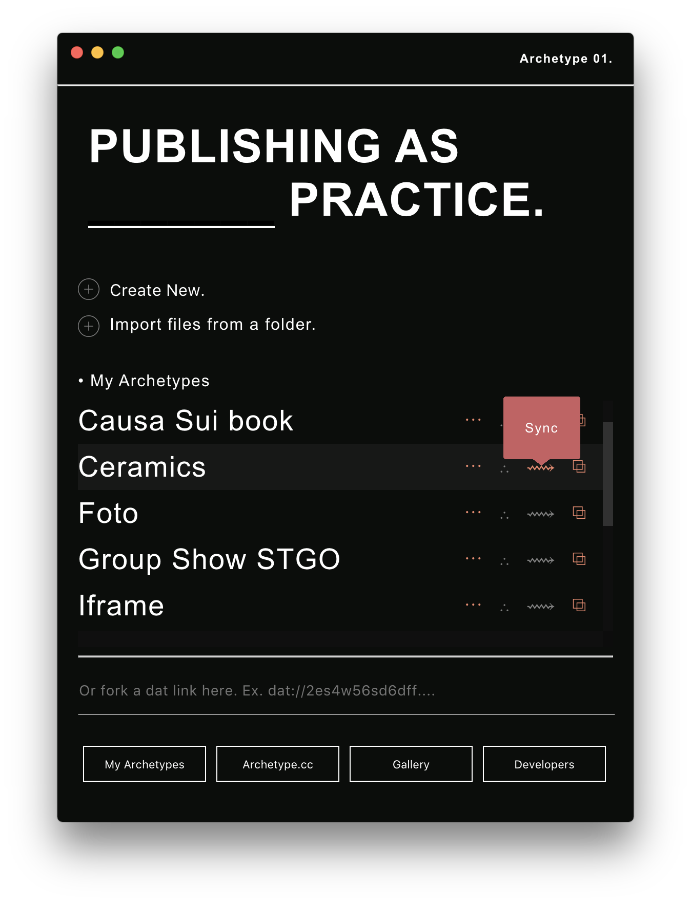

<h1 align="center">Archetype #01</h1>

  

## Features

- Create or import files to a new Folder ready to be sync to Dat.
- Organizes your practice Project-by-Project. Folder-By-Folder.
- Fork archives.

## Why ?

This is an experimental tool created to help publishing files with Dat.

## Getting Started

Soon

## How it works

Soon!

## Roadmap

Soon.

## TODO:

- [ ] Add Documentation.
- [ ] Add Option to drop entire folders.
- [ ] Create Archetype Index with sublinks
- [ ] Sync and Open Folder Feedback
- [ ] Watch Changes
- [ ] Clean up Code
- [x] Add Starter Theme
- [X] Add copy to clipboard link
- [X] Add dat.json to folder
- [X] Add import theme from dat link
- [X] Add theme blank
- [X] Watch folder changes to sync
- [X] Show dat link in the app
- [X] Preview Theme on port

**_This project is currently under development**
